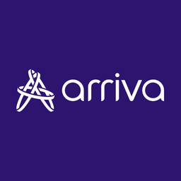
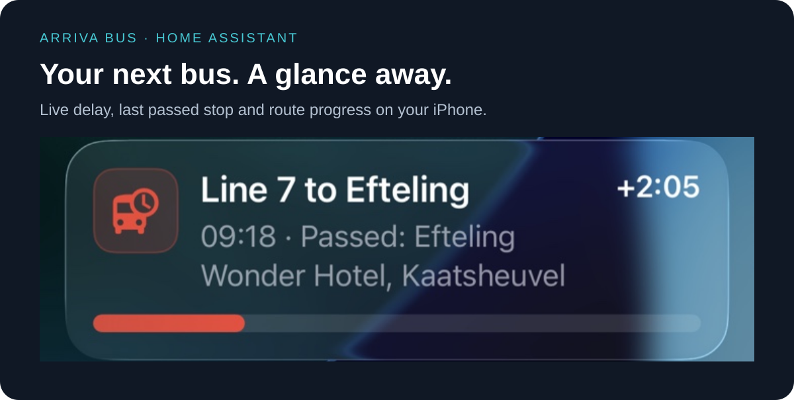
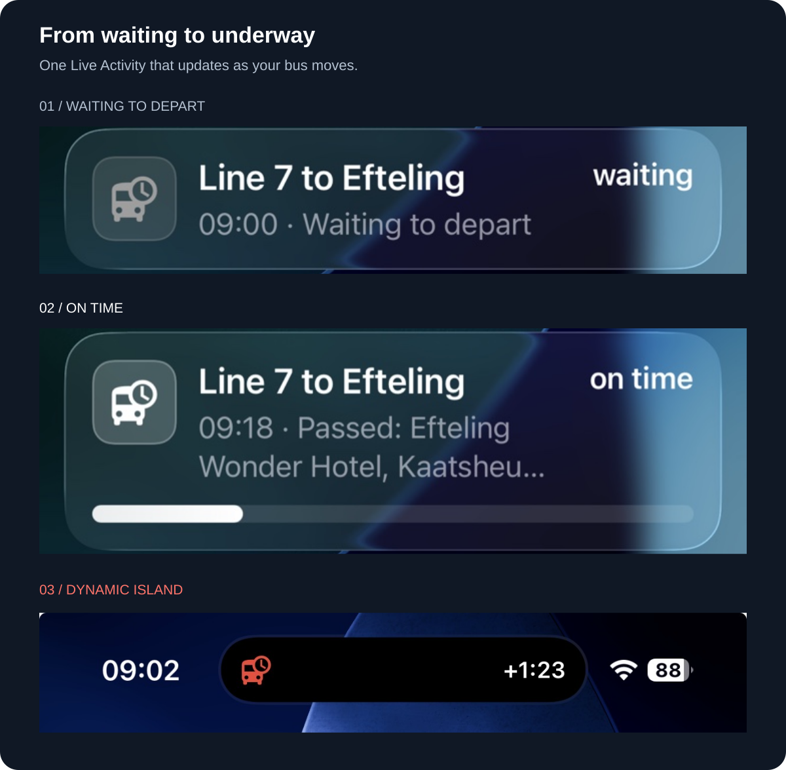
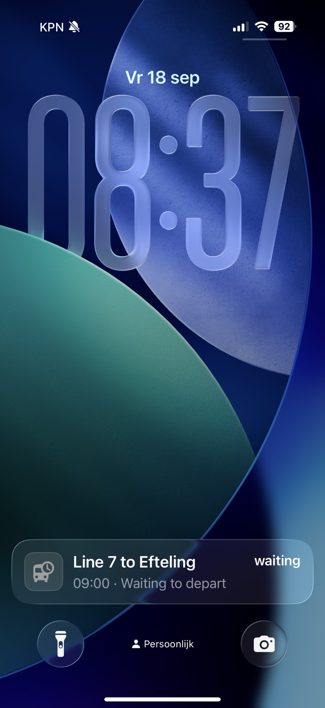
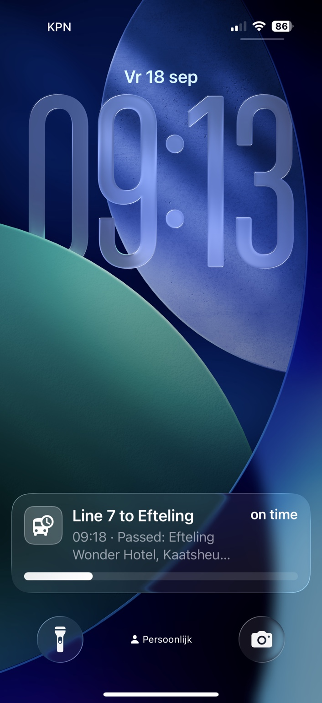
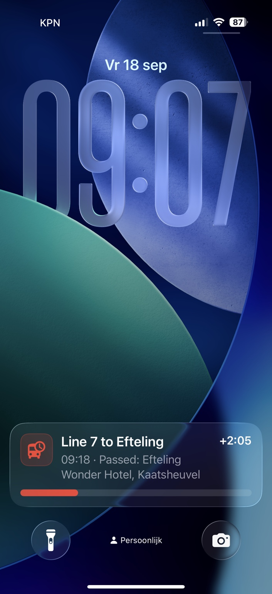

# Arriva Bus for Home Assistant

  

  

**Your next bus, live on your iPhone.** Pick your line, destination and stop —
keep the next arrival in view on your Lock Screen and Dynamic Island.

[Install with HACS](#installation-with-hacs) · [Explore the entities](#available-entities) · [Share feedback](https://github.com/digital-IMEI/home-assistant-arriva-bus/issues)

See the live times of the **next Arriva bus arriving at your selected stop**, directly
in Home Assistant. Choose a line, destination and stop from searchable lists; the
integration then follows the first upcoming journey for that exact combination and
automatically moves on to the following journey after it has passed.

The entities and optional iPhone Live Activity show whether that next bus is waiting,
underway, early, on time, delayed or cancelled, together with its current or last passed
stop and the scheduled passage time at your selected stop.

No YAML, stop codes, journey IDs, API keys or separate server are required. It runs
directly on Home Assistant, including Home Assistant Green.

The standout feature is the optional **iPhone Live Activity**: current delay, journey
position and route progress remain visible on the Lock Screen and in the Dynamic Island.
Updates happen in place instead of producing a new notification for every change.

This is an independent community project and is not affiliated with or endorsed by Arriva.

## What makes it useful

- A guided setup: **line → destination → stop → optional iPhones**.
- Stops appear in route order, so no knowledge of internal stop codes is needed.
- Exact realtime delay, including seconds rather than rounded timetable minutes.
- Distinguishes underway, waiting, cancelled and temporarily unavailable journeys.
- Accounts for scheduled dwell time, so a bus is not incorrectly shown as early while
  it is waiting for its planned departure time.
- Tracks the current or last passed stop and calculates progress along the actual journey.
- Keeps one Live Activity available between journeys without repeated notification pop-ups.
- Supports multiple routes and multiple iPhones.
- Provides normal Home Assistant entities for dashboards, templates and automations.
- Dutch and English setup and Live Activity text.

## Live Activity

The Live Activity can show:

- line and destination;
- scheduled passage time at the selected stop;
- exact delay, early running or **on time** status;
- current stop, last passed stop or departure stop;
- visual route progress while the bus is underway;
- waiting and cancellation states;
- the next journey when no bus is currently underway.

Its icon changes with the journey state, so waiting, driving, stopping, running early,
delay, cancellation and temporarily unavailable realtime data are also recognisable at
a glance.

Tapping the Live Activity opens the Home Assistant device page for that configured route,
giving direct access to all its entities. A separate switch lets an automation enable or
disable the Live Activity without disabling bus tracking.

### Live Activity examples

  

Real screenshots, focused on the information you need. Captured before the
status-specific icons introduced in v1.1.3; current icons are listed below.

View the original full-screen screenshots

  
  
  

The waiting state stays compact and deliberately omits the progress bar. Once underway,
the bar shows visual progress from the first stop to the stop selected during setup.

| Journey state | Live Activity icon |
| --- | --- |
| Waiting for departure | Clock |
| Underway and on time | Bus |
| At a stop / selected stop passed | Bus stop |
| Running early | Fast-forward |
| Delayed | Bus warning |
| Cancelled | Cancel |
| Realtime temporarily unavailable | Cloud warning |

## Available entities

Each configured line/destination/stop combination becomes its own Home Assistant device.
Entity IDs are generated by Home Assistant; the table lists the displayed entity names.

| Entity | Type | Purpose |
| --- | --- | --- |
| **Current delay** | Sensor · duration | Exact delay in seconds. Attributes include the raw delay, realtime state, source stop, source event, observation time and journey identifiers. |
| **Bus position** | Sensor · text | Current stop, last passed stop, waiting state or a stable no-bus fallback. Attributes identify the position type and underlying stop codes. |
| **Journey status** | Sensor · enum | `No bus underway`, `Waiting to depart`, `Underway`, `Realtime temporarily unavailable`, `Journey cancelled` or `Previous journey cancelled`. |
| **Next stop passage** | Sensor · timestamp | Scheduled arrival/passage time of the first upcoming bus at the stop selected during setup. |
| **Integration active** | Switch | Starts or stops realtime tracking. A newly configured route starts active by default and can later be controlled manually or by an automation. |
| **Live Activity** | Switch | Starts or ends Live Activity updates on all selected iPhones without disabling the other entities. |

The sensors also expose useful attributes such as `delay_seconds`, `is_underway`,
`realtime_connected`, `realtime_stale`, `journey_number`, `journey_key`,
`last_passed_stop`, `current_stop`, `target_stop_code` and `ndov_line_id` when available.

## Installation with HACS

Home Assistant 2026.8.2 or newer is required.

1. Open HACS → **Integrations**.
2. Open the menu and choose **Custom repositories**.
3. Add `https://github.com/digital-IMEI/home-assistant-arriva-bus` as an **Integration**.
4. Search for **Arriva Bus** and install the latest release.
5. Restart Home Assistant and refresh the frontend/Companion app.
6. Open **Settings → Devices & services → Add integration → Arriva Bus**.
7. Select a line, destination and stop. Optionally select one or more iPhones.

The tracker becomes active immediately after first setup. Use **Integration active** if
you want to control its operating times with your own automation.

## Manual installation

1. Download `arriva_bus.zip` from the [latest release](https://github.com/digital-IMEI/home-assistant-arriva-bus/releases/latest).
2. Create `/config/custom_components/arriva_bus/` and extract the contents of the archive
   into that directory. The manifest must be located at
   `/config/custom_components/arriva_bus/manifest.json`.
3. Restart Home Assistant and refresh the frontend/Companion app.
4. Add **Arriva Bus** through **Settings → Devices & services**.

## Delay colours

Live Activity colours can be changed per configured route.

| State | Threshold | Default |
| --- | --- | --- |
| Early | 30 seconds early or more | Green |
| On time / tolerance | −29 through +60 seconds | White |
| Late | More than 60 seconds late | Red |
| Waiting, no bus or missing realtime | No current delay to display | Gray |
| Cancelled | Explicit cancellation | Red |

Choose **Default** or clear a colour field to restore its default. Colour and device
changes apply without restarting the tracker. Removed phones receive an end command.

## Data sources and limitations

The compact searchable catalogue is built outside Home Assistant from OVapi GTFS and
NDOV CHB. The current catalogue contains hundreds of lines and thousands of stop places
while remaining small enough for Home Assistant Green. Live journey selection uses DRGL;
vehicle positions use NDOV KV6.

Coverage depends on those public sources. Stops with missing or ambiguous mappings and
some foreign stops may be omitted. Circular services and route variants cannot always be
represented by one perfect merged stop list; once a journey is selected, progress uses
that journey's actual route.

Live Activity text follows the configured Home Assistant language. The Companion app's
notification registration does not expose the individual phone language, so separate
automatic languages per iPhone are not currently possible.

iOS can limit Live Activities to eight hours and may throttle or batch silent updates.
The phone must be able to reach Home Assistant away from home for Live Activity token
exchange. A successful Home Assistant notify action confirms hand-off to the Companion
integration, not final delivery by iOS. See the
[Home Assistant Companion documentation](https://companion.home-assistant.io/docs/notifications/live-activities/).

## Feedback and contributions

Different lines and route variants are valuable test cases. Please report problems through
[GitHub Issues](https://github.com/digital-IMEI/home-assistant-arriva-bus/issues) and include:

- Home Assistant and Arriva Bus versions;
- selected line, destination and stop;
- expected and observed behaviour;
- relevant logs or diagnostics.

Check diagnostics for private information before publishing them.
